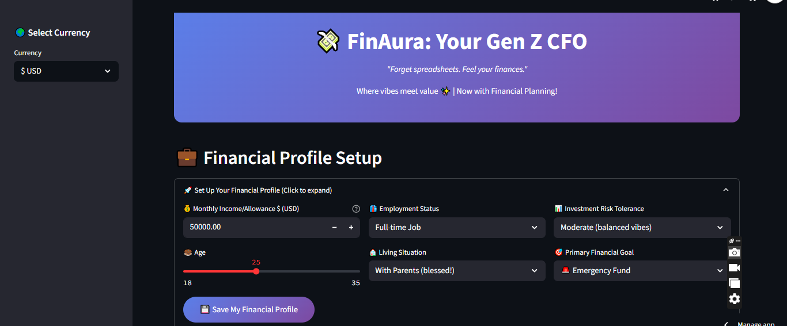
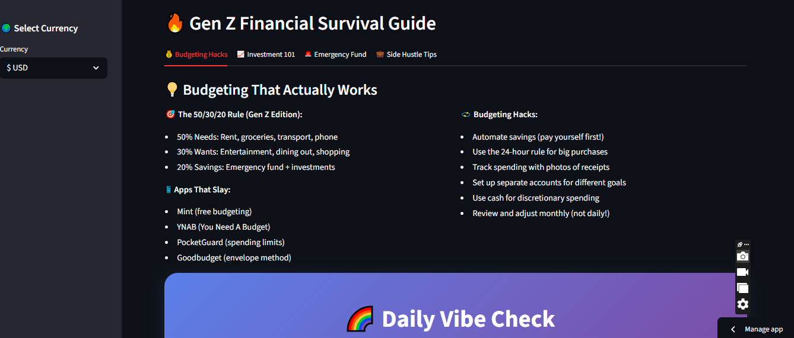
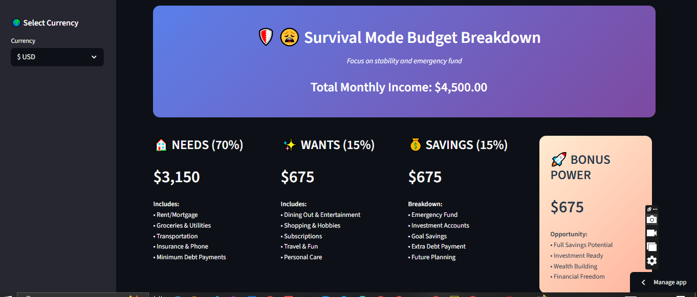

 # 💸 FinAura – Your Gen Z CFO 🤘

> **Forget spreadsheets. Feel your finances.**  
> A vibe-first AI finance companion replacing the need for traditional financial advisors or boring budgeting apps.  
> **📍 Live Now → [https://finaura.streamlit.app/](https://finaura.streamlit.app/)**

---



---

## 😫 The Problem: Gen Z & Financial Anxiety

Today’s Gen Z is:

- 🧾 Overwhelmed by spreadsheets & financial jargon
- 💳 Living paycheck to paycheck with rising debt
- 😬 Suffering from spending guilt and anxiety
- 😶‍🌫️ Lacking access to real financial advice (who can afford a CA?)
- 🧠 Emotionally disconnected from their money

---

## 💡 The Solution: **FinAura**

**FinAura** is a smart, emotional, and vibey AI-powered CFO that:

- 💬 Talks to you based on your **money mood**
- 📊 Builds personalized **budgets & saving plans**
- 📈 Suggests **investments & emergency funds**
- 💰 Tracks spending guilt, joy, and monthly habits
- 🎯 Helps you grow **financially + mentally strong**

---

## ✨ Built for Gen Z. Designed to Slay.



---

## 🌈 Key Features

| 🔥 Feature             | ✅ Description |
|------------------------|----------------|
| 💬 **Vibe Check AI**    | Mood-based financial feedback with emojis |
| 💸 **Smart Budgeting**  | Personalized 50/30/20 (and Slay Mode) budgeting |
| 📈 **Investment Tips**  | Age & risk-based portfolio planning |
| 🛍️ **Joy vs Guilt Spend** | Track emotional patterns in purchases |
| 🚨 **Emergency Fund**   | Set realistic goals & automate savings |
| 💳 **Debt Simulator**   | Plan how to pay off loans, fast |
| 💼 **Side Hustle Ideas**| Curated income paths for students |
| 🎯 **Goal Tracker**     | Plan that dream trip, gadget, or house deposit |

---

## 🖥️ Tech Stack

| Layer       | Stack Used                    |
|-------------|-------------------------------|
| UI/UX       | `Streamlit` + Gen Z CSS vibes |
| Logic       | `Python`, `async`, `OOP`       |
| Data        | `SQLite`, `pandas`             |
| Charts      | `Plotly`, `Seaborn`            |
| AI Layer    | Rule-based mood-to-advice NLP  |

---

## 📸 More Screenshots

### 📊 Personalized Budget Interface


---

### 💡 Instant AI Suggestions


---

## 🧠 Who Is This For?

- 🧑‍🎓 Students who want to save smarter
- 💼 Freelancers or side hustlers
- 🧘‍♀️ Anyone with money anxiety
- 💬 People who think "Finance apps are boring"
- 🎯 Anyone who loves structure + vibes

---

## 🚀 Try It Live

**▶ [Launch FinAura Now](https://finaura.streamlit.app/)**  
> 100% free. No login. Just you + your money + your mood.

---

## 🔮 FinAura 2.0 Roadmap

Coming soon:

- 🎙️ Voice-based FinGPT assistant  
- 💳 Live bank account integration (Plaid)  
- 📲 Mobile version for iOS/Android  
- 📚 AI-based financial literacy tutorials  
- 🧠 Mood-based saving nudges  

---

## 👩‍💻 About the Creator

**Eesha Tariq**  


- 🔗 [GitHub](https://github.com/eeshatariqofficial)  
- 🔗 [LinkedIn](https://linkedin.com/in/eeshatariq)

---

## 🛠️ Run Locally

```bash
git clone https://github.com/eeshatariqofficial/FinAura.git
cd FinAura
pip install -r requirements.txt
streamlit run streamlit_app.py
